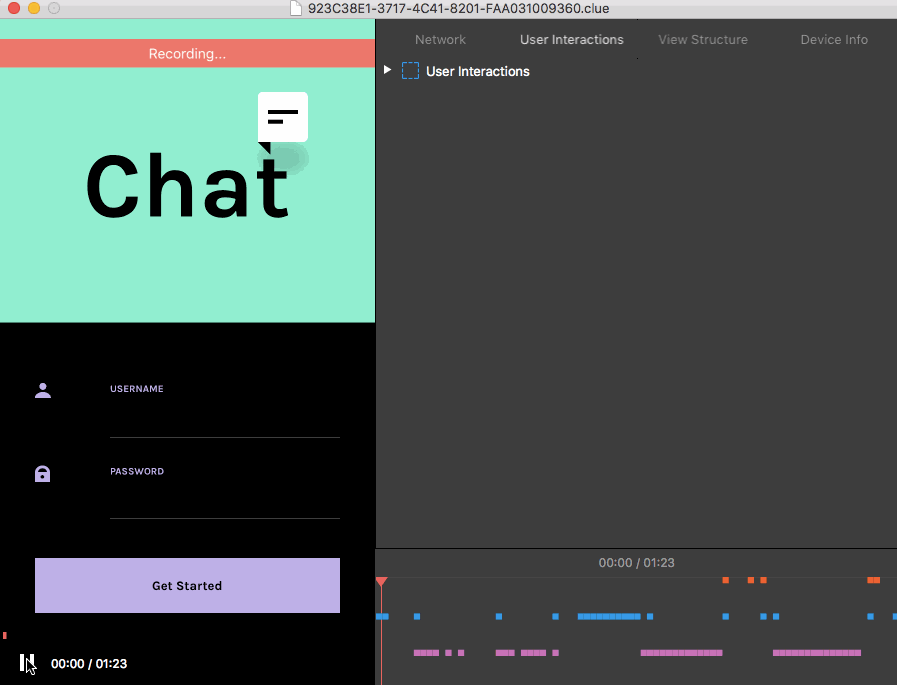

# Clue macOS application

    
        
    
    

 

    

 

**Clue macOS app** is a simple viewer application for .clue smart bug report files generated by [Clue iOS framework](http://https://github.com/Geek-1001/Clue), which allow your users to record full bug/crash report and send it to you as a single .clue file via email.  
Bug report includes full video of the screen, views structure, all network operations, all user interactions during recording and device info.
 

## ➡️ 🖥️  How to install

### Download
You can download Clue app from latest release archive which contains `.dmg` file with Clue.app
Just drag and drop `.app` file into Application folder.

### Build Manually
1. Clone the repo `git clone git@github.com:Geek-1001/Clue-macOS-application.git`
2. Open **Clue.xcodeproj** with Xcode
3. Choose `Clue` build schema and build it with Xcode
4. Right click on the **Clue.app** file from Product folder and select `Show in Finder`
5. Copy and Paste **Clue.app** file from Finder right to the Application folder on your mac

## 💻 How to use
As soon as you get new .clue report file from your user just double click on that file and Clue macOS app opens it.
- With Timeline view you can see all user actions with timestamp value
- With Video view you can watch video record right from user's screen
- With Detailed view you can explore details about all network operations, view structure changes and user interactions during report recording (also you can explore details about user's device).

## 🛣️ Roadmap
- [x] Build MVP app to open .clue file
- [x] Build timeline to see connections between user action and application's responses
- [ ] Add tests for all Models' classes
- [ ] Fix all 20 TODOs
- [ ] Write own implementation of custom tab bar controller
- [ ] Add ability to show custom modules (written by third-party developers)
- [ ] Upload to Mac App Store (if needed)
 

## ☎️ Contacts
Feel free to reach me on twitter [@ahmed_sulajman](https://twitter.com/ahmed_sulajman) or drop me a line on ahmed.sulajman@gmail.com
 

## 📄 Licence
Clue macOS application is released under the MIT License. See the LICENSE file.
